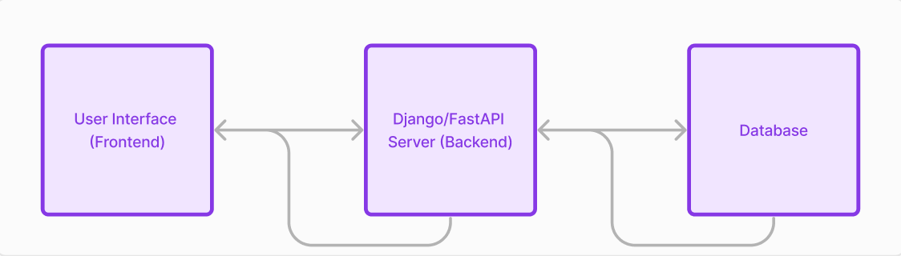

## AP3 Interview - Round 2 - Task

To design a cookbook web app that allows for the creation, management, and viewing of recipes, I’m going to use Python Django for the website, FastAPI for the backend API, and a PostgreSQL database (PostgreSQL supports the TEXT[ ] data type used to store recipe instructions). The codebases for the website and the API would be separate, which would ensure a greater degree of modularity and scalability. Although this decision does introduce some version control and CI/CD complexity, in my opinion, the benefits of modularity and scalability outweigh these issues.

### Architecture
At the highest level, here’s the architecture I would use:


### Data Model Listing the Object Types and Properties

#### SQL Schema


```sql
CREATE TABLE Recipe (
    id INT PRIMARY KEY, -- Recipe ID
    title VARCHAR(255), -- Recipe name
    instructions TEXT[],
    serving_size INT
);

CREATE TABLE Ingredient (
    id INT PRIMARY KEY,
    recipe_id INT,
    item VARCHAR(255), 
    quantity DECIMAL, -- Numerical part of the quantity
    unit VARCHAR(255), -- Unit of measurement (e.g., cup, tablespoon)
    description TEXT,  -- Additional descriptive information (e.g., 'room temperature', 'softened')
    FOREIGN KEY (recipe_id) REFERENCES Recipe(id)
);
```

#### Python Model Classes
```python
class Recipe:
    def __init__(self, id, title, instructions, serving_size):
        self.id = id
        self.title = title
        self.instructions = instructions  # This is a list of text elements, each a step in the recipe
        self.serving_size = serving_size
        self.ingredients = []  # List of Ingredient objects

    def add_ingredient(self, ingredient):
        self.ingredients.append(ingredient)

class Ingredient:
    def __init__(self, id, recipe_id, item, quantity, unit, description):
        self.id = id
        self.recipe_id = recipe_id
        self.item = item
        self.quantity = quantity  # Decimal type for numerical quantity
        self.unit = unit  # String type for unit of measurement
        self.description = description  # Text field for additional descriptive information
```

### REST API Specifications

1. Create Recipe
	- Path: /recipes/
	- Method: POST
	- Body: { title, instructions, ingredients }

2. List All Recipes
	- Path: /recipes/
	- Method: GET

3. View Individual Recipe
	- Path: /recipes/{recipe_id}
	- Method: GET

4. Edit Recipe
	- Path: /recipes/{recipe_id}
	- Method: PUT
	- Body: { title, instructions, ingredients }

5. Delete Recipe
	- Path: /recipes/{recipe_id}
	- Method: DELETE

#### Front End Code Samples

DjangoAppDirectory/App/views.py

```python
from django.http import HttpResponse, JsonResponse  # used for handling API responses
from django.shortcuts import render, redirect  # used for page rendering
from django.contrib import messages  # Django's messages framework provides a mechanism for passing temporary messages from the server-side  (Django views) to the client-side (templates)
import helpers  # helper functions module
import logging

# Configure logging
logging.basicConfig(level=logging.INFO)
logger = logging.getLogger(__name__)

BASE_URL = 'https://my-api.com:8000/'


def home(request):
    template = 'App/home.html'
    logger.info('Loading home page')
    return render(request, template)


def view_all_recipes(request):
    recipes = helpers.api_get(f'{BASE_URL}recipes/')
    context = {'recipes': recipes or []}
    template = 'App/view_all_recipes.html'
    logger.info('Loading view_all_recipes page')
    return render(request, template, context)


def view_recipe(request, recipe_id):
    recipe = helpers.api_get(f'{BASE_URL}recipes/{recipe_id}')
    context = {'recipe': recipe}
    template = 'App/view_recipe.html'
    return render(request, template, context)


def create_recipe(request):
    recipe_data_user_input = ''
    if request.method == 'POST':
        recipe_data_user_input = request.POST.get('input_field', '')
        recipe_data = helpers.recipe_data_to_json(recipe_data_user_input)

        if not helpers.api_post(f'{BASE_URL}recipes/', recipe_data):
            messages.error(request, 'Recipe creation failed, please try again.')

    context = {
        'input_field': recipe_data_user_input,
        'messages': messages.get_messages(request)
    }
    template = 'App/create_recipe.html'
    return render(request, template, context)


def edit_recipe(request, recipe_id):
    recipe_data_user_input = ''

    if request.method == 'POST':
        recipe_data_user_input = request.POST.get('input_field', '')
        updated_recipe_data = helpers.recipe_data_to_json(recipe_data_user_input)

        if not helpers.api_put(f'{BASE_URL}recipes/{recipe_id}', updated_recipe_data):
            messages.error(request, 'Recipe edit failed, please try again.')

    recipe = helpers.api_get(f'{BASE_URL}recipes/{recipe_id}') or {}
    context = {
        'recipe': recipe,
        'input_field': recipe_data_user_input
    }
    template = 'App/edit_recipe.html'
    return render(request, template, context)


def delete_recipe(request, recipe_id):
    if request.method == 'POST':
        if not helpers.api_delete(f'{BASE_URL}recipes/{recipe_id}'):
            messages.error(request, 'Failed to delete the recipe, please try again.')

    context = {
        'recipe_id': recipe_id,
        'messages': messages.get_messages(request)
    }
    template = 'App/delete_recipe.html'
    return render(request, template, context)
```

DjangoAppDirectory/App/helpers.py
```python
import requests  # library used to handle HTTP requests
import json  # helps with json processing
import logging

# Configure logging
logging.basicConfig(level=logging.INFO)
logger = logging.getLogger(__name__)


def api_get(url):
    """
    Send a GET request to the specified URL.

    Args:
    url (str): The URL to which the GET request is sent.

    Returns:
    dict or None: The JSON response parsed into a dictionary if the response status is 200; otherwise, None.
    """
    try:
        response = requests.get(url)
        return response.json() if response.status_code == 200 else None
    except requests.RequestException as e:
        logger.error(f"Error during GET request to {url}: {e}")
        return None


def api_post(url, data):
    """
    Send a POST request to the specified URL with the provided data.

    Args:
    url (str): The URL to which the POST request is sent.
    data (dict): The data to be sent in the POST request.

    Returns:
    bool: True if the response status code is 200, indicating success; False otherwise.
    """
    try:
        response = requests.post(url, json=data)
        return response.status_code == 200
    except requests.RequestException as e:
        logger.error(f"Error during POST request to {url}: {e}")
        return False


def api_put(url, data):
    """
    Send a PUT request to the specified URL with the provided data.

    Args:
    url (str): The URL to which the PUT request is sent.
    data (dict): The data to be sent in the PUT request.

    Returns:
    bool: True if the response status code is 200, indicating success; False otherwise.
    """
    try:
        response = requests.put(url, json=data)
        return response.status_code == 200
    except requests.RequestException as e:
        logger.error(f"Error during PUT request to {url}: {e}")
        return False


def api_delete(url):
    """
    Send a DELETE request to the specified URL.

    Args:
    url (str): The URL to which the DELETE request is sent.

    Returns:
    bool: True if the response status code is 200, indicating successful deletion; False otherwise.
    """
    try:
        response = requests.delete(url)
        return response.status_code == 200
    except requests.RequestException as e:
        logger.error(f"Error during DELETE request to {url}: {e}")
        return False


def recipe_data_to_json(recipe_data_user_input):
    """
    Convert the recipe data from user input (a string) into JSON format.

    Args:
    recipe_data_user_input (str): A string containing the recipe data.

    Returns:
    dict: The recipe data in JSON (dictionary) format, or None if an error occurs.
    """
    try:
        # Split the input into lines
        lines = recipe_data_user_input.split('\n')

        # Assuming components would be provided in this format
        title = lines[0]
        serving_size = int(lines[1])  # Convert serving size to an integer
        ingredients = lines[2]
        steps = lines[3:]

        # Construct the recipe JSON (dictionary)
        recipe_json = {
            'title': title,
            'serving_size': serving_size,
            'ingredients': ingredients,
            'instructions': steps
        }

        return recipe_json

    except Exception as e:
        # Log the exception and return None or handle it as needed
        logger.error(f"Error processing recipe data: {e}")
        return None
```

#### Back End Code Sample

FastAPI
```python
from fastapi import FastAPI, HTTPException
from pydantic import BaseModel
from typing import List, Optional
import logging

app = FastAPI()

# Configure logging
logging.basicConfig(level=logging.INFO)
logger = logging.getLogger(__name__)


class Ingredient(BaseModel):
    item: str
    quantity: float  # Numerical quantity
    unit: Optional[str] = None  # Optional unit of measurement
    description: Optional[str] = None  # Optional additional description


class Recipe(BaseModel):
    title: str
    instructions: List[str]  # List of instruction steps
    ingredients: List[Ingredient]
    serving_size: int  # Number of servings


recipes_database_placeholder = {}  # let's assume this is the PostgreSQL DB


@app.put("/recipes/{recipe_id}")
def update_recipe(recipe_id: int, recipe: Recipe):
    """
    Update an existing recipe.

    Args:
    recipe_id (int): The ID of the recipe to update.
    recipe (Recipe): The updated recipe data.

    Returns:
    dict: A success message.
    """
    try:
        if recipe_id not in recipes_database_placeholder:
            logger.warning(f"Recipe with ID {recipe_id} not found")
            raise HTTPException(status_code=404, detail="Recipe not found")
        recipes_database_placeholder[recipe_id] = recipe  # update existing recipe with the new version
        logger.info(f"Recipe with ID {recipe_id} updated successfully")
        return {"message": "Recipe updated successfully"}
    except Exception as e:
        logger.error(f"Error updating recipe with ID {recipe_id}: {e}")
        raise HTTPException(status_code=500, detail="Error updating recipe")
```

